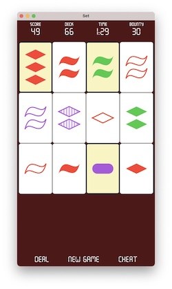
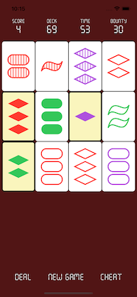

#  Learning SwiftUI

from Professor Paul Hegarty, Stanford University CS193p Spring 2021 course

This project implements the game app **Set** as required in [Assignment III: Set](https://cs193p.sites.stanford.edu/sites/g/files/sbiybj16636/files/media/file/assignment_3_0.pdf).

Rules of the **Set** game are described [here](https://en.wikipedia.org/wiki/Set_(card_game)).

Implemented:

- most of Assignment III requirements
- simple time and score keeping
- cheat
- iOS and macOS targets

 

